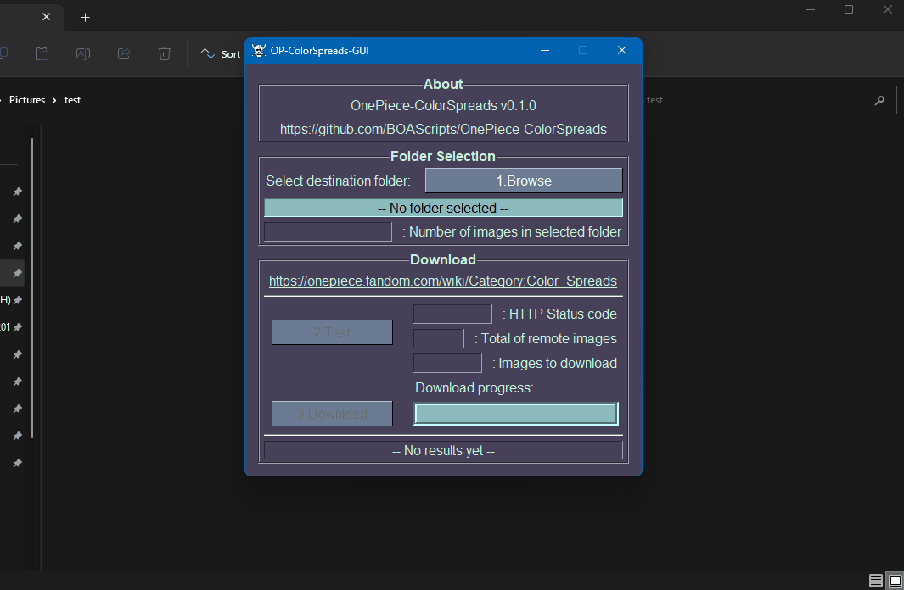

# OnePiece-ColorSpreads

Download all color spreads of One Piece.

## About

Written in Python 3.11.3, using PySimpleGui and BeautifulSoup modules

Those tools can each download all the color spreads of One Piece in the selected folder,and update a selected folder with the latest color spreads.

All color spreads comes from: `https://onepiece.fandom.com/wiki/Category:Color_Spreads`

## Usage

3 tools are available in the release section, download and unzip `OP-ColorSpreads-Bundle.zip` :

- `OP-ColorSpreads-GUI.exe`
- `OP-ColorSpreads-GUI.py`
- `OP-ColorSpreads-CLI.py`

> All 3 tools do the same thing.

For windows users the `.exe` is the easiest to use as it doesn't require a python installation.

### GUI

- EXE:
    - Run `OP-ColorSpreads.exe`

- PY:
    - `pip install -r requirements.txt`
    - `python3 OP-ColorSpreads.py`

### CLI

- `pip install -r requirements.txt` 
- `python3 OP-ColorSpreads-CLI.py -p "{your_download_directory_here}"`

## Extra

- I'm not checking the available disk space. As of today the 180 color spreads takes ~800mb.
